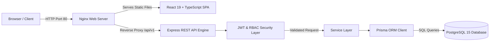
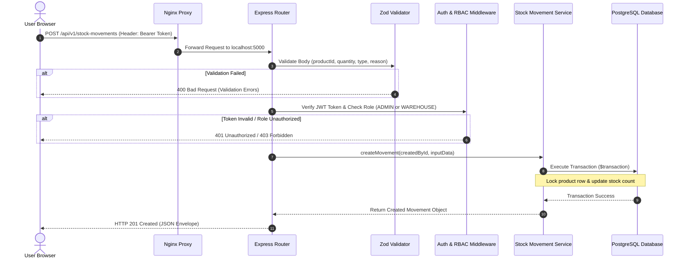
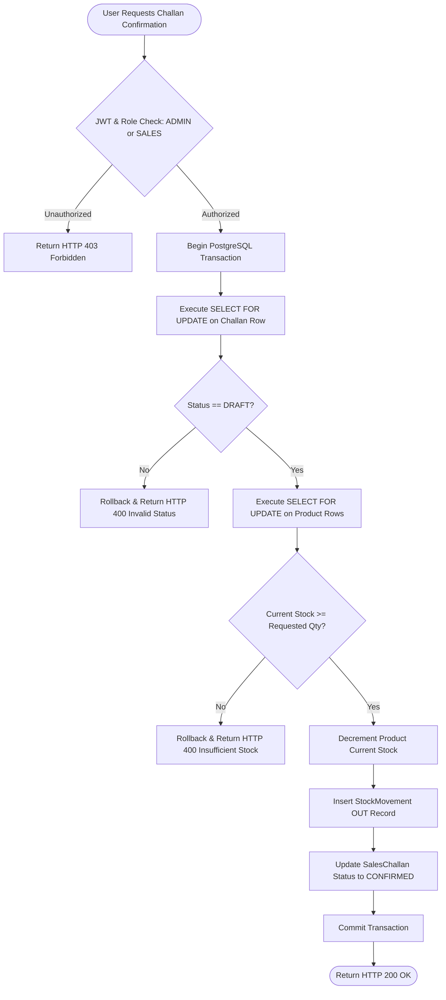

# Nexora System Architecture

This document provides a technical overview of Nexora's application architecture, runtime component interactions, request flows, and business workflow processing.

## 1. System Overview

Nexora is built as a single-page application (SPA) frontend decoupled from a stateless Express REST API backend. Persistence is managed via Prisma ORM connected to a PostgreSQL relational database.

---

## 2. Component Responsibilities

### Nginx (Reverse Proxy & Web Server)
- Serves static compiled React production assets (`/var/www/nexora`).
- Proxies `/api/v1` HTTP requests to the backend Express server listening locally on port 5000.
- Handles HTTP connection management and basic request routing.

### Frontend Application (React 19 SPA)
- **Framework**: React 19 + Vite 8 + TypeScript.
- **State Management & Data Fetching**: TanStack Query (v5) handles API caching, polling, and cache invalidation.
- **Form Management**: React Hook Form with Zod schema resolution (`@hookform/resolvers`).
- **Styling System**: Tailwind CSS v4 paired with CSS custom properties for dark, light, and system theme switching.

### Backend Application (Node.js & Express API)
- **Framework**: Express 4 with TypeScript.
- **Request Validation**: Zod middleware validating query parameters and request bodies prior to controller execution.
- **Authentication & RBAC**: Custom JWT verification middleware and role restriction checks (`ADMIN`, `SALES`, `WAREHOUSE`, `ACCOUNTS`).
- **Service Layer**: Implements core business logic, database transactions, sequence locking, and atomic stock deductions.

### Database Layer (PostgreSQL 15 & Prisma ORM)
- **ORM**: Prisma ORM (v5.10.2) providing type-safe query generation and migration management.
- **Pessimistic Locking**: Executes raw SQL `SELECT ... FOR UPDATE` locks inside transactions to enforce inventory consistency under concurrent write operations.
- **Sequence Generator**: Uses PostgreSQL atomic UPSERT operations (`INSERT ... ON CONFLICT DO UPDATE`) to produce gapless annual sales challan numbers (`CH-YYYY-XXXX`).

---

## 3. End-to-End Request Processing Flow

The diagram below details the path of an authenticated write request (such as recording a stock movement) through the system:

---

## 4. Sales Challan Fulfillment Workflow

The fulfillment of a sales challan involves moving stock from reserved availability to dedicated dispatch while maintaining accurate inventory records:

---

## 5. User Management & Authorization Architecture

Nexora enforces strict administrative isolation for user management:

- **Frontend Isolation**: The `Users` link in the main navigation sidebar is dynamically rendered only when `user.role === 'ADMIN'`. The router guards `/users` and `/users/:id` using `<ProtectedRoute allowedRoles={['ADMIN']} />`.
- **Backend Isolation**: Every endpoint under `/api/v1/users` is guarded by `authenticateJwt` and `requireRole([Role.ADMIN])`. Direct HTTP calls by non-admin users return HTTP `403 Forbidden`.
- **Self & Last-Admin Protection**:
  - Administrators cannot delete, demote, or suspend their own account.
  - The system blocks modification or suspension of the final remaining `ADMIN` account in the database.
- **Account Suspension**: When a user's status is updated to `SUSPENDED`, login attempts fail with `HTTP 403 ACCOUNT_SUSPENDED`.
