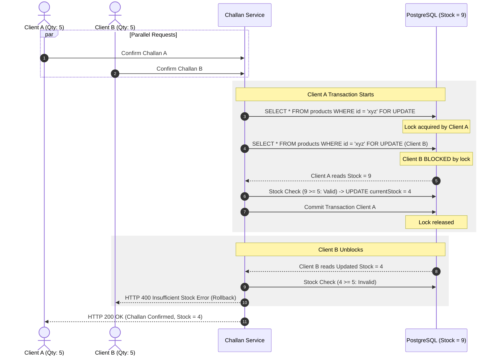

# Concurrency & Inventory Consistency Architecture

This document explains Nexora's concurrency control mechanisms, race-condition prevention strategies, and empirical test results verifying inventory data integrity under parallel write loads.

## 1. The Inventory Race Condition Problem

In wholesale and distribution applications, a common vulnerability is inventory overselling caused by concurrent requests.

### Problem Scenario Without Locking
1. Product stock is currently **9**.
2. **Client A** sends a request to confirm a sales challan for **5 units**.
3. **Client B** simultaneously sends a request to confirm a sales challan for **5 units**.
4. Both Client A and Client B execute `SELECT currentStock FROM products WHERE id = 'xyz'`.
5. Both queries return `currentStock = 9`.
6. Client A checks `9 >= 5` (True) and proceeds.
7. Client B checks `9 >= 5` (True) and proceeds.
8. Client A updates `currentStock = 9 - 5 = 4`.
9. Client B updates `currentStock = 4 - 5 = -1`.

**Result**: Stock drops to `-1` (oversold by 1 unit), violating inventory integrity.

---

## 2. Pessimistic Row Locking Solution (`SELECT ... FOR UPDATE`)

Nexora prevents race conditions by combining PostgreSQL **pessimistic row-level locking** with interactive database transactions (`prisma.$transaction`).

### Execution Flow with Locking



---

## 3. Atomic Challan Sequence Generation

Sales challan numbers follow a strict annual sequential pattern (`CH-YYYY-XXXX`). To ensure no duplicate challan numbers are generated when multiple clients create draft challans simultaneously, Nexora uses PostgreSQL atomic upserts:

```sql
INSERT INTO challan_sequences (year, "lastValue") 
VALUES ($1, 1)
ON CONFLICT (year) 
DO UPDATE SET "lastValue" = challan_sequences."lastValue" + 1
RETURNING "lastValue";
```

This ensures that sequence increment and retrieval occur as a single atomic operation inside PostgreSQL.

---

## 4. Empirical Concurrency Test Results

The backend includes a dedicated Vitest test suite (`backend/src/__tests__/concurrency.test.ts`) that launches parallel HTTP requests using `Promise.all` against the active Express API engine.

### Test 1: Valid Split Request
- **Initial Stock**: `9`
- **Concurrent Requests**: Client A (`quantity = 5`) + Client B (`quantity = 4`)
- **Execution**: Parallel `Promise.all`
- **Result**: **PASS**
  - Client A Status: `HTTP 200 OK` (5 units deducted)
  - Client B Status: `HTTP 200 OK` (4 units deducted)
  - Final Stock: `0`
  - Stock OUT Movements Created: `2` (`-5`, `-4`)

### Test 2: Oversale Race Condition
- **Initial Stock**: `9`
- **Concurrent Requests**: Client A (`quantity = 5`) + Client B (`quantity = 5`) (Total requested: `10`)
- **Execution**: Parallel `Promise.all`
- **Result**: **PASS**
  - Successful Requests: `1` (`HTTP 200 OK`)
  - Failed Requests: `1` (`HTTP 400 Bad Request`, Code: `INSUFFICIENT_STOCK`)
  - Final Stock: `4`
  - Overselling Prevented: **YES**
  - Negative Stock Prevented: **YES**

### Test 3: High Contention (5 Parallel Clients)
- **Initial Stock**: `9`
- **Concurrent Requests**: 5 parallel clients requesting `3`, `3`, `2`, `2`, `1` units (Total requested: `11`)
- **Execution**: Parallel `Promise.all`
- **Result**: **PASS**
  - Successful Requests: `4` (Total quantity fulfilled: `9`)
  - Failed Requests: `1` (Request for 2 units rejected cleanly)
  - Final Stock: `0`
  - Overselling Prevented: **YES**
